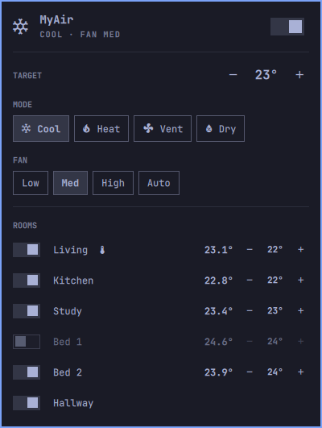

# MyAir for Omarchy

An [Omarchy](https://omarchy.org) shell (Quickshell) bar widget for
**Advantage Air MyAir / MyPlace** ducted air conditioning.

See the system state at a glance in the bar, and open a panel to read every
room's temperature and drive the unit — power, mode, fan speed, the system
setpoint, and per-room zones.



- **Bar pill** — mode icon plus the current target (`❄ 24°`), dimmed when the
  unit is off, and a disconnect icon when the tablet is unreachable. Hovering
  shows every open room's temperature.
- **Panel** — power, Cool / Heat / Vent / Dry, fan Low / Med / High / Auto, the
  system target, and one row per room with its measured temperature, an
  open/close switch and its own setpoint.
- Rooms without a temperature sensor show no reading and no setpoint.
- The room the unit is currently regulating on (`myZone`) is marked 󰔏.

Everything is driven over your **local network**. No cloud account, no
Advantage Air login, nothing leaves your LAN.

## Requirements

- Omarchy 4 ("Quattro") or newer, i.e. the Quickshell-based shell — not the
  older Waybar bar.
- `curl` (already present on Omarchy).
- A MyAir5 / MyPlace wall tablet reachable on your network. The tablet serves
  a local HTTP API on port **2025**; nothing needs to be enabled for it.

Older MyAir3 systems use a different protocol and are **not** supported.

## Install

```bash
omarchy plugin add https://github.com/codemonkey76/omarchy-myair --enable
```

Or by hand:

```bash
git clone https://github.com/codemonkey76/omarchy-myair \
  ~/.config/omarchy/plugins/io.github.codemonkey76.myair
```

Then add it to a bar section in `~/.config/omarchy/shell.json` (see below) and
run `omarchy restart shell`.

## Configuration — pointing it at your unit

**This is the one thing you must set.** The widget does not guess or scan; it
only talks to the address you give it.

Find your widget's entry in `~/.config/omarchy/shell.json` (under
`bar.layout.left`, `.center` or `.right`) and set `host` to your tablet's IP:

```jsonc
{
  "id": "io.github.codemonkey76.myair",
  "host": "192.168.1.11"
}
```

Then `omarchy restart shell`.

Until `host` is set the widget shows **NOT CONFIGURED** and tells you to add it.

### Finding your tablet's IP

Easiest — **on the MyAir tablet itself**: open the MyPlace/MyAir app's menu and
look under *System* / *Network* for its IP address.

From your **router's** admin page, look in the DHCP client list for a device
named something like `MyPlace` or `eZaire`.

Or **scan for it** — the tablet is whatever answers on port 2025. Change
`192.168.1` to match your own subnet (check with `ip -4 addr`):

```bash
for i in $(seq 1 254); do
  ( curl -s -m 2 -o /dev/null -w "%{http_code} 192.168.1.$i\n" \
      "http://192.168.1.$i:2025/getSystemData" & )
done | grep '^200'
```

You can confirm you have the right box with:

```bash
curl -s http://<tablet-ip>:2025/getSystemData | jq '.system.sysType, .aircons.ac1.info'
```

> **Tip:** give the tablet a static DHCP reservation on your router. If it
> picks up a new address the widget just goes to *Unreachable* until you
> update `host`.

### All options

| Key              | Default  | Meaning                                                        |
|------------------|----------|----------------------------------------------------------------|
| `host`           | *unset*  | **Required.** Tablet IP or hostname.                            |
| `port`           | `2025`   | API port. Leave alone unless you know otherwise.                |
| `ac`             | `"ac1"`  | Which aircon unit. Multi-unit installs may need `ac2`, ...      |
| `refreshSeconds` | `30`     | Poll interval while the panel is closed (min 5). Open: 5s.      |

If `getSystemData` shows more than one key under `aircons`, set `ac` to the
one you want. One widget drives one unit; add a second entry for a second.

## Usage

| Action | Result |
|---|---|
| Left click | Open / close the panel |
| Right click | Toggle power |
| Middle click | Force a refresh |
| `p` (panel open) | Toggle power |
| `r` (panel open) | Refresh |
| `Esc` | Close |

Setpoint steps are 0.5°, clamped to 16–32°.

It can also be driven over IPC:

```bash
omarchy-shell io.github.codemonkey76.myair toggle   # open/close the panel; also: open, close
omarchy-shell io.github.codemonkey76.myair power
omarchy-shell io.github.codemonkey76.myair refresh
```

## Behaviour worth knowing

**Controls are optimistic.** The unit takes a second or two to report a change
back, so the panel updates immediately and reconciles when the tablet confirms.
Repeated `+`/`-` taps are debounced into a single request, and several rooms
adjusted at once are batched into one call.

**Stale readings are kept, but go read-only.** If the tablet stops answering
(a laptop leaving the house) the last known temperatures stay on screen so
they're still useful, the panel says *Unreachable*, and the controls dim and
stop accepting input rather than queueing requests that cannot land.

**Mid-write responses are ignored.** The tablet serves a payload with all-null
values while it applies a change; the widget discards those rather than
flashing a panel full of dashes.

## Troubleshooting

**Panel says *Unreachable*.** Check the address answers:
`curl -s http://<host>:2025/getSystemData | head -c 100`. If that works but the
widget doesn't, confirm `host` is on the widget's own entry in `shell.json`.

**Edits to this plugin don't show up.** Omarchy logs a plugin reload that does
not always take effect, and `omarchy-shell shell rescanPlugins` may not help
either. Run `omarchy restart shell`.

**A control does nothing.** The tablet rejects values it doesn't know, and the
panel shows the reason in place of the status line.

## Notes on the API

The vocabulary was probed against a real MyAir5 rather than assumed — the
tablet validates enum values and answers `{"ack":false,"reason":...}` without
applying, which rules out plausible guesses:

- `mode` — `cool`, `heat`, `vent`, `dry` (not `fan`)
- `fan` — `low`, `medium`, `high`, `auto` (not `med`)

`setTemp` is **not** validated: the tablet acks any number, including 35 or
negative values, so this widget clamps to 16–32° client-side.

## Removal

```bash
omarchy plugin remove io.github.codemonkey76.myair
```

That unregisters the plugin and deletes its directory. If you installed by
hand, remove the entry from `bar.layout` in `~/.config/omarchy/shell.json`,
delete `~/.config/omarchy/plugins/io.github.codemonkey76.myair`, then run
`omarchy restart shell`.

The plugin writes nothing outside its own directory, and stores no state: its
only configuration is the entry you add to `shell.json`.

## License

MIT — see [LICENSE](LICENSE).

Not affiliated with or endorsed by Advantage Air. "MyAir" and "MyPlace" are
their trademarks.
